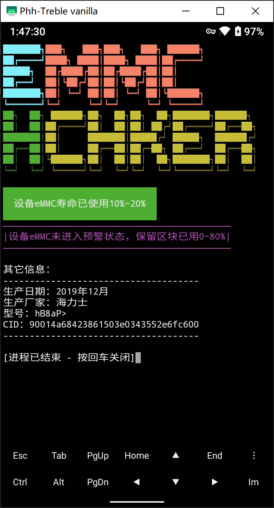
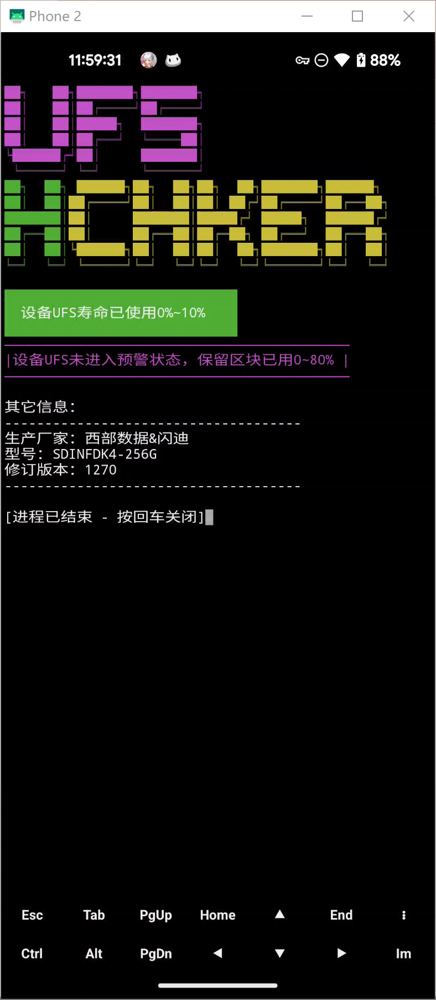

# Emmc_HealthyChecker
A script for checking emmc healthy life

Goal:
- [x] 基本的读取eMMC已用寿命信息
- [x] 基本的读取eMMC保留区块使用信息
- [x] 添加颜色显示
- [ ] 更改文字输出为图形条状
- [x] 读取eMMC的附加信息，如**生产日期，品牌型号和料号**
- [x] 读取并识别闪存厂家
- [ ] 闪存测速包括顺序读写和io性能
- [x] 添加UFS支持（？
- [ ] More...（？

